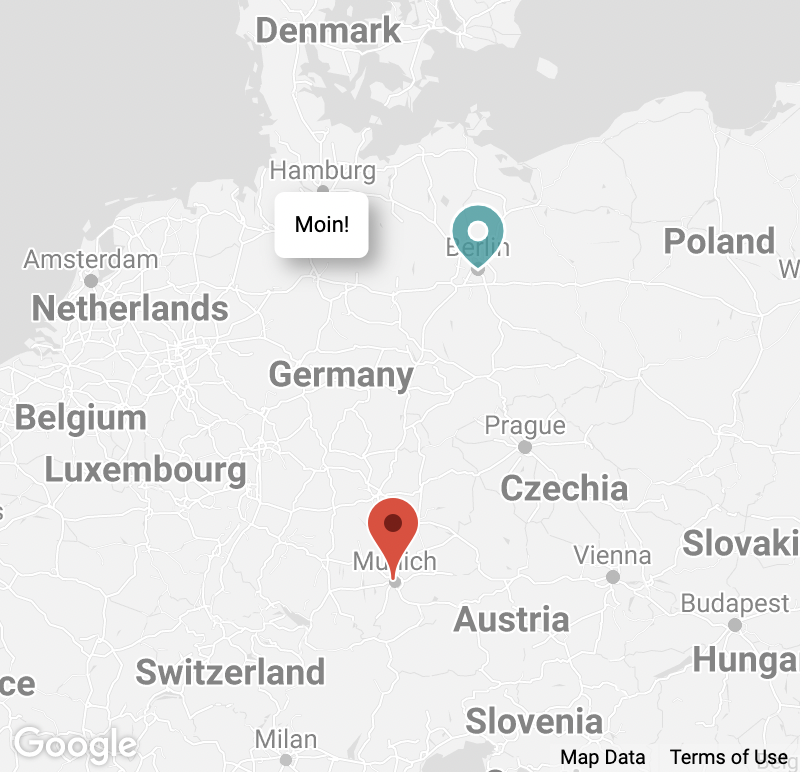

# googlemaps-react-primitives

📍 Google Maps primitives for React



[](https://codesandbox.io/s/clever-bush-godk3)

## Rationale

When looking for a way to add Google Maps to a React application you'll find [tons](https://www.npmjs.com/package/google-map-react) of [different](https://www.npmjs.com/package/react-google-maps) solutions and [libraries](https://www.npmjs.com/package/@react-google-maps/api).

The idea behind this module is to stick to [Google's official guide for React](https://developers.google.com/maps/documentation/javascript/react-map) as close as possible and provide the missing bits and pieces.

## Features

- Written in TypeScript
- Super lightweight
- Tree shakeable
- Works with @googlemaps/react-wrapper

# Installation

```
npm install @googlemaps/react-wrapper googlemaps-react-primitives
npm install -D @types/google.maps
```

# Usage

This basic example shows everything that's needed in order to display a Google Map with its default options:

```tsx
import { Wrapper, Status } from "@googlemaps/react-wrapper";
import { GoogleMap } from "googlemaps-react-primitives";

function renderLoadingStatus(status: Status) {
  return <h1>{status}</h1>;
}

function App() {
  return (
    <Wrapper apiKey="YOUR_API_KEY" render={renderLoadingStatus}>
      <GoogleMap style={{ width: "400px", height: "400px" }} />
    </Wrapper>
  );
}
```

To configure the map you can pass [all supported options](https://developers.google.com/maps/documentation/javascript/reference/map#MapOptions) as props:

```tsx
<GoogleMap center={{ lat: 53.551086, lng: 9.993682 }} zoom={11} />
```

## Map Markers

You can place standard markers on the map using the `Marker` component. It supports all [marker options](https://developers.google.com/maps/documentation/javascript/reference/marker#MarkerOptions) as props.

```tsx
import { GoogleMap, Marker } from "googlemaps-react-primitives";

function MyMap() {
  return (
    <GoogleMap>
      <Marker position={{ lat: 53.551086, lng: 9.993682 }} />
      <Marker position={{ lat: 52.520008, lng: 13.404954 }} />
    </GoogleMap>
  );
}
```

You can use this primitive to create a customized markers, for example to draw a custom path:

```tsx
function MyMarker(props: google.maps.MarkerOptions) {
  return (
    <Marker
      {...props}
      icon={{
        path: "M9 22C9 22 18 16 18 9C18 4.02944 13.9706 0 9 0C4.02944 0 0 4.02944 0 9C0 16 9 22 9 22ZM12 9C12 10.6569 10.6569 12 9 12C7.34315 12 6 10.6569 6 9C6 7.34315 7.34315 6 9 6C10.6569 6 12 7.34315 12 9Z",
        strokeColor: "#FFFFFF",
        fillColor: "#009A9E",
        fillOpacity: 0.8,
        scale: 1.5,
        anchor: new google.maps.Point(9, 22),
      }}
    />
  );
}
```

By default, Google markers can only provide a single SVG path. To allow more complex icons, this library includes a utility component to render complete SVGs:

```tsx
import { GoogleMap, SvgMarker } from "googlemaps-react-primitives";

function MyMap() {
  return (
    <GoogleMap>
      <SvgMarker
        position={{ lat: 48.864716, lng: 2.349014 }}
        svg={`<svg viewBox="0 0 24 24" xmlns="http://www.w3.org/2000/svg">
              <path fill="#e74c3c" d="M12 0a8 8 0 0 0-7 12l7 12 7-12a8 8 0 0 0-7-12zm0 4a4 4 0 1 1 0 8 4 4 0 0 1 0-8z" />
              <path fill="#c0392b" d="M12 3a5 5 0 1 0 0 10 5 5 0 0 0 0-10zm0 2a3 3 0 1 1 0 6 3 3 0 0 1 0-6z" />
            </svg>`}
      />
    </GoogleMap>
  );
}
```

## Overlays

You can render arbitrary React component onto the map by using the `Overlay` component:

```tsx
import { GoogleMap, Overlay } from "googlemaps-react-primitives";

function MyMap() {
  return (
    <GoogleMap>
      <Overlay position={{ lat: 123, lng: 456 }}>
        <div>Hello</div>
      </Overlay>
      <Overlay position={{ lat: 124, lng: 457 }}>
        <div>World</div>
      </Overlay>
    </GoogleMap>
  );
}
```

As with custom markers, it makes sense to create your own component that uses the `Overlay` primitive. Note that the overlay content is rendered into an absolutely positioned div and the top-left corner is placed at the given coordinates. You can use a CSS transform to center it horizontally:

```tsx
interface Props {
  position: google.maps.LatLngLiteral;
  text: string;
}

function MyOverlay({ position, text }: Props) {
  return (
    <Overlay position={position} preventMapHits>
      <div style={{ transform: "translateX(-50%)" }}>{text}</div>
    </Overlay>
  );
}
```

**Note:** You can pass the `preventMapHits` property to stop clicks etc. from bubbling up to the map.

## Auto-fitting the map view

When placing markers or overlays on the map you can pass the `autoFit` prop in order to automatically center and zoom the map so that all nested markers and overlays are visible in the initial viewport.

```tsx
import { GoogleMap, Marker } from "googlemaps-react-primitives";

function MyMap() {
  return (
    <GoogleMap autoFit maxZoom={14}>
      <Marker position={{ lat: 123, lng: 456 }} />
      <Marker position={{ lat: 124, lng: 457 }} />
    </GoogleMap>
  );
}
```

## Accessing the map instance

When you write custom components that need to access the map instance, you can use the `useMap()` hook.

## Viewing the example

When you check out the repository you can view the example using the following command:

`VITE_API_KEY=<yourApiKey> npx vite`

# License

MIT
